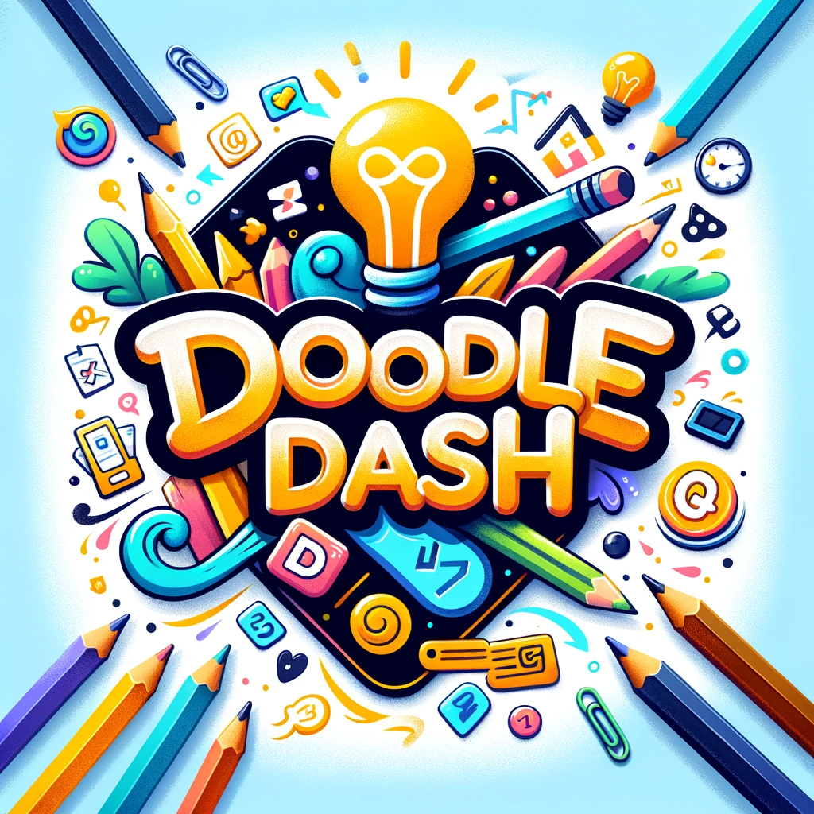

<h1 align="center">DoodleDash 🎨</h1>

<p align="center">
  
</p>

Welcome to DoodleDash, a game where you draw and let the AI guess! The objective is simple: draw the word provided as clearly and quickly as you can, while your AI teammate (GPT-4 Vision) tries to guess it. The more words the AI guesses correctly within the time limit, the higher your score!

## Demo 📹

https://github.com/Chasearmer/DoodleDash/assets/23300817/96018055-d558-40b8-89b8-eb8a5232a814


## Getting Started 🚀

Follow these steps to get started:

1. **Install Node.js and npm**: If you haven't installed Node.js or npm, get them [here](https://nodejs.org/). This project has been tested with Node.js version 20.x and npm version 10.x.

2. **Clone the repository**: Clone this repository to your local machine using `git clone https://github.com/yourusername/doodledash.git`.

3. **Install the dependencies**: Navigate to the project directory and run `npm install` to install all the necessary packages.

4. **Set your OpenAI API Key**: To authenticate with the OpenAI API, you need to set your API key. Open the `config.js` file located in the `src` directory. Inside the `config.js` file, modify the following line:
    ```
    OPENAI_API_KEY=your-api-key-here
    ```
    Make sure to replace `your-api-key-here` with your actual OpenAI API key.

5. **Start the game**: Run `npm start` to start the game. Open [http://localhost:3000](http://localhost:3000) to view it in your browser.

## Gameplay 🎮

Check out this [video](https://www.loom.com/share/e3a6631390a44179a8ad2f97d0d78da0?sid=ea4c9329-2abb-47cd-8865-39215e9fb900) for DoodleDash gameplay (same as embedded video above).

## Contributing 🤝

DoodleDash is open-source and contributions are always welcome! Feel free to open issues and submit pull requests.

## License 📄

This project is licensed under the MIT License - see the [LICENSE](https://opensource.org/license/mit/) file for details.

Happy doodling! 🖌️
